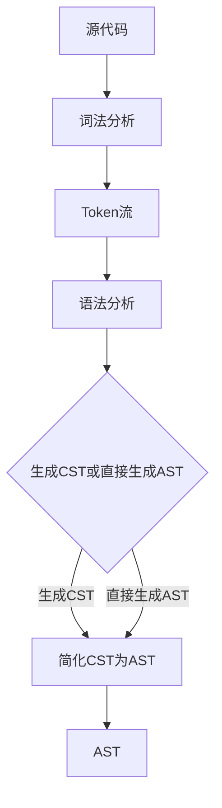

## AST做每一行代码后面标明行号

- 解析源代码生成AST​，使用 @babel/parser 解析代码，节点包含 loc 属性（记录起始/结束行号和列号）

```js
const parser = require('@babel/parser');
const code = `function add(a, b) {
  return a + b;
}`;
const ast = parser.parse(code, {
  sourceType: 'module',
  plugins: ['jsx']
});
```
- 遍历AST获取行号信息​，通过遍历AST节点，收集需要添加行号的代码行范围。
```js
// 需注意：
// ​节点覆盖范围​​：某些节点（如函数体、块语句）可能跨越多行。
// 空行与注释​​：需单独处理无AST节点的行（如空行或注释行）。
const traverse = require('@babel/traverse').default;

const linesWithCode = new Set();
traverse(ast, {
  enter(path) {
    const { start, end } = path.node.loc;
    for (let line = start.line; line <= end.line; line++) {
      linesWithCode.add(line);
    }
  }
});
```

- 插入行号注释​，根据收集的行号信息，在对应代码行末尾插入行号注释。
```js
// 需处理以下情况：
​// ​保留原始代码格式​​：避免破坏代码缩进或语法。
​// ​注释格式统一​​：如 // 行号: X 或 // X。
const codeLines = code.split('\n');
const modifiedLines = codeLines.map((line, index) => {
  const lineNumber = index + 1;
  if (linesWithCode.has(lineNumber)) {
    return `${line}  // 行号: ${lineNumber}`;
  }
  return line;
});
const modifiedCode = modifiedLines.join('\n');
```

- 生成最终代码​，将修改后的代码行合并为完整代码，并输出。若需保留AST结构，可使用代码生成工具（如 @babel/generator）重新生成代码
```js
const fs = require('fs');
const parser = require('@babel/parser');
const traverse = require('@babel/traverse').default;
const generator = require('@babel/generator').default;

// 读取源代码
const code = fs.readFileSync('input.js', 'utf-8');

// 解析AST
const ast = parser.parse(code, {
  sourceType: 'module',
  plugins: ['jsx']
});

// 收集有代码的行号
const linesWithCode = new Set();
traverse(ast, {
  enter(path) {
    const { start, end } = path.node.loc;
    for (let line = start.line; line <= end.line; line++) {
      linesWithCode.add(line);
    }
  }
});

// 插入行号注释
const codeLines = code.split('\n');
const modifiedLines = codeLines.map((line, index) => {
  const lineNumber = index + 1;
  if (linesWithCode.has(lineNumber)) {
    return `${line}  // 行号: ${lineNumber}`;
  }
  return line;
});
const modifiedCode = modifiedLines.join('\n');

// 输出结果
fs.writeFileSync('output.js', modifiedCode);
```


## AST的生成阶段
在抽象语法树（AST）的生成阶段，核心流程分为词法分析、语法分析和AST构建三个阶段，部分工具还会加入语义分析和优化步骤。以下是具体流程及技术细节：

---

**1. 词法分析（Lexical Analysis）**
目标：将源代码拆分为最小语法单元（Token），并过滤无关字符（如空格、注释）。  
关键步骤：  
1. 字符流读取：逐字符读取源代码，形成字符序列。  
2. Token识别：根据预定义规则（正则表达式）匹配Token类型，例如：  
   • 标识符（如变量名、函数名）  

   • 关键字（如 `if`、`function`）  

   • 运算符（如 `+`、`=`）  

   • 字面量（如数字、字符串）  

3. 生成Token流：将识别出的Token按顺序存入列表，例如代码 `let a = 1 + 2;` 会被解析为：  
   ```text
   [ {type: 'Keyword', value: 'let'}, 
     {type: 'Identifier', value: 'a'}, 
     {type: 'Punctuator', value: '='}, 
     {type: 'Numeric', value: 1}, 
     {type: 'Punctuator', value: '+'}, 
     {type: 'Numeric', value: 2} ]
   ```  
工具示例：  
• JavaScript：Esprima、Acorn  

---

**2. 语法分析（Syntax Analysis）**
目标：根据语言语法规则（如上下文无关文法）将Token流转换为具体语法树（CST）或直接生成AST。  
关键步骤：  
1. 构建解析树：  
   • 使用递归下降法、LL(1)或LR(1)等算法，将Token流按语法规则组织成树形结构。  

   • 例如，表达式 `a + b * c` 的CST可能包含完整的运算符优先级结构。  

2. 错误检测：  
   • 检测语法错误（如括号不匹配、缺少分号），并抛出错误信息。  

工具示例：  
• Babel（JavaScript）  

• Python的`ast`模块  

• Calcite（SQL解析）  


---

**3. AST构建（AST Generation）**
目标：从CST或直接从Token流生成抽象语法树，去除冗余信息并抽象逻辑结构。  
关键步骤：  
1. 简化结构：  
   • 合并连续的节点（如将 `a = 1 + 2` 的CST简化为 `AssignmentExpression` 节点）。  

   • 去除无意义符号（如分号、括号）。  

2. 语义抽象：  
   • 标记节点类型（如 `FunctionDeclaration`、`IfStatement`）。  

   • 建立父子关系，形成树状结构。  

3. 添加元信息：  
   • 记录行号、列号（用于调试和错误定位）。  

   • 标记作用域、类型信息（部分工具在后续阶段处理）。  

示例：  
```javascript
// 原始代码
function add(a, b) {
  return a + b;
}

// AST结构（简化）
{
  type: 'FunctionDeclaration',
  id: { type: 'Identifier', name: 'add' },
  params: [ { type: 'Identifier', name: 'a' }, { type: 'Identifier', name: 'b' } ],
  body: {
    type: 'BlockStatement',
    body: [ { type: 'ReturnStatement', argument: { type: 'BinaryExpression', operator: '+', left: 'a', right: 'b' } } ]
  }
}
```
工具示例：  
• Babel的`@babel/parser`  

• Python的`ast.dump()`  

• Calcite的`SqlNode`  


---

**4. 可选步骤：语义分析与优化**
部分工具会在AST生成后进行语义处理：  
1. 类型检查：验证变量类型是否匹配（如TypeScript）。  
2. 作用域分析：检测变量声明与引用是否合法。  
3. 初步优化：如常量折叠（`2 + 3 → 5`）。  
工具示例：  
• ESLint（静态检查）  

• TypeScript编译器  


---

**5. AST生成流程图**


---

**技术细节与差异**
1. CST与AST的区别：  
   • CST（具体语法树）保留所有语法细节（如括号），AST（抽象语法树）仅保留逻辑结构。  

   • 例如，`a + b * c` 的CST可能显式包含运算符优先级，而AST直接表示为 `Add(a, Multiply(b, c))`。  

2. 语言差异：  
   • 不同语言的AST节点类型和结构不同（如Python的`ast.Module` vs JavaScript的`Program`）。  

3. 工具选择：  
   • 自定义AST生成时，需根据语言特性设计解析器和节点类型。  


---

**应用场景**
• 编译器：将高级语言转换为中间代码（如LLVM IR）。  

• 转译工具：Babel将ES6+代码转译为ES5。  

• 静态分析：ESLint检测代码风格问题。  

• IDE功能：代码补全、错误提示（如VS Code）。  


通过理解AST生成流程，开发者可以更好地定制代码转换逻辑（如Babel插件）或实现自定义编译器。