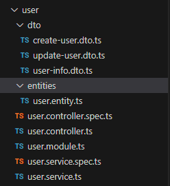

# nestjs实践
## 前言
 最近想学一下node做BFF层的一些东西，之前学过express框架配合MongoDB，做过一些简单的增删改查项目，有一点node基础，看到nestjs这几年特别火，决定学一下。网上搜了一些以前的别人的实践来试一下，这是我实践以后记录下来的一些实践经验和踩坑记录，做一个总结以及加深记忆。

 ## 介绍
 Nest.js官网介绍：
 > Nest (NestJS) 是一个用于构建高效、可扩展的 Node.js 服务器端应用程序的开发框架。它利用JavaScript 的渐进增强的能力，使用并完全支持 TypeScript （仍然允许开发者使用纯 JavaScript 进行开发），并结合了 OOP （面向对象编程）、FP （函数式编程）和 FRP （函数响应式编程）。
在底层，Nest 构建在强大的 HTTP 服务器框架上，例如 Express （默认），并且还可以通过配置从而使用 Fastify ！
Nest 在这些常见的 Node.js 框架 (Express/Fastify) 之上提高了一个抽象级别，但仍然向开发者直接暴露了底层框架的 API。这使得开发者可以自由地使用适用于底层平台的无数的第三方模块。

 ## 优势
 先说一下nestjs的一些优点
 - 良好的ts支持
 - 装饰器实现注解式的开发体验
 - 方便集成Swagger、redis等
 - 可以基于Express也可以选择fastify, 如果你对Express非常熟练， 直接用它的API也是没问题的

## 创建项目
第一步先创建一个新项目
```bash
npm i -g @nestjs/cli  // 全局安装Nest
nest new project-name  // 创建项目
```

推荐使用yarn和pnpm，记得更换淘宝镜像源，下载可以稍微顺畅一点，别再用那个taobao路径的源了，几年前就停止服务了。
```
npm config set registry https://registry.npmmirror.com
yarn config set registry https://registry.npmmirror.com
pnpm config set registry https://registry.npmmirror.com
```

nest需要比较高的node版本，18.17.0左右的版本，我常年用16.18.0左右的版本，所以还是下载了一个nvm去管理node版本升级一下。

这里有一个坑的点，是nvm安装后，发现nvm use不生效，这样一般两种情况：
- 没开管理员权限
- nvm和node路径冲突了

网上很多答复都是重装node，我才不想又删一堆东西，万一还删不干净，重新安装又要卸载（重装噩梦），后来看到解决方法是把环境变量里的node环境变量删掉，完美解决。

第二个坑就是，切换node版本，如果那个版本没有安装nest，你会发现提示无法识别nest命令，你需要重新跑一遍install nest的命令。

### 直接启动项目
`pnpm start`每次修改代码需要重新启动才能看到效果.

建议用 `pnpm start:dev`，因为这个是加了--watch监听的命令，更改代码能热更新。


| 环境    | 版本     |
|---------|----------|
| Node.js | v18.17.0 |
| npm     | 9.6.7    |
| nestjs  | 10.3.2   |

## 文件结构

- dto: 我的理解就是这里主要是装入参类型的
- entities：这里是定义接口返回值类型的
- 包含`spec`: 这个是写单元测试的
- controller：后端的控制层，主要是定义接口路径、类型，还有一些拦截器使用等等
- module： 我的理解就是这里是用于引入与导出，与其他模块交互，还有往这个模块底层注入一些其他模块的方法实体之类的，让全局可用
- service： 主要业务逻辑的实现层，具体怎么查表联调操作之类的，都在这里写


 ## 参考
 https://juejin.cn/post/7032079740982788132