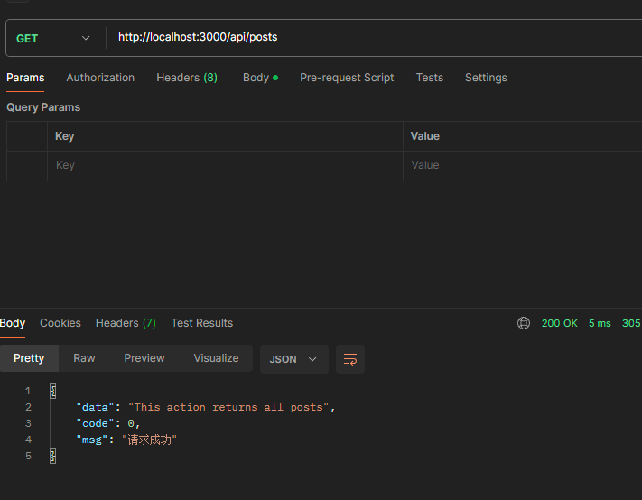

# nestjs实践
## 前言
 最近想学一下node做BFF层的一些东西，之前学过express框架配合MongoDB，做过一些简单的增删改查项目，有一点node基础，看到nestjs这几年特别火，决定学一下。网上搜了一些以前的别人的实践来试一下，这是我实践以后记录下来的一些实践经验和踩坑记录，做一个总结以及加深记忆。

 ## 介绍
 Nest.js官网介绍：
 > Nest (NestJS) 是一个用于构建高效、可扩展的 Node.js 服务器端应用程序的开发框架。它利用JavaScript 的渐进增强的能力，使用并完全支持 TypeScript （仍然允许开发者使用纯 JavaScript 进行开发），并结合了 OOP （面向对象编程）、FP （函数式编程）和 FRP （函数响应式编程）。
在底层，Nest 构建在强大的 HTTP 服务器框架上，例如 Express （默认），并且还可以通过配置从而使用 Fastify ！
Nest 在这些常见的 Node.js 框架 (Express/Fastify) 之上提高了一个抽象级别，但仍然向开发者直接暴露了底层框架的 API。这使得开发者可以自由地使用适用于底层平台的无数的第三方模块。

 ## 优势
 先说一下nestjs的一些优点
 - 良好的ts支持
 - 装饰器实现注解式的开发体验
 - 方便集成Swagger、redis等
 - 可以基于Express也可以选择fastify, 如果你对Express非常熟练， 直接用它的API也是没问题的

## 创建项目
第一步先创建一个新项目
```bash
npm i -g @nestjs/cli  // 全局安装Nest
nest new project-name  // 创建项目
```

推荐使用yarn和pnpm，记得更换淘宝镜像源，下载可以稍微顺畅一点，别再用那个taobao路径的源了，几年前就停止服务了。
```
npm config set registry https://registry.npmmirror.com
```

nest需要比较高的node版本，18.17.0左右的版本，我常年用16.18.0左右的版本，所以还是下载了一个nvm去管理node版本升级一下。

这里有一个坑的点，是nvm安装后，发现nvm use不生效，这样一般两种情况：
- 没开管理员权限
- nvm和node路径冲突了

网上很多答复都是重装node，我不想删一堆东西，万一还删不干净，重新安装又要卸载（重装噩梦），后来看到解决方法是把环境变量里的node环境变量删掉，完美解决。

第二个坑就是，切换node版本，如果那个版本没有安装nest，你会发现提示无法识别nest命令，你需要重新跑一遍install nest的命令。

### 直接启动项目
`pnpm start`每次修改代码需要重新启动才能看到效果.

建议用 `pnpm start:dev`，因为这个是加了--watch监听的命令，更改代码能热更新。


| 环境    | 版本     |
|---------|----------|
| Node.js | v18.18.0 |
| npm     | 9.6.7    |
| nestjs  | 10.3.2   |

## 文件结构

- dto: 我的理解就是这里主要是装入参类型的
- entities：这里是定义接口返回值类型的
- 包含`spec`: 这个是写单元测试的
- controller：后端的控制层，主要是定义接口路径、类型，还有一些拦截器使用等等
- module： 我的理解就是这里是用于引入与导出，与其他模块交互，还有往这个模块底层注入一些其他模块的方法实体之类的，让全局可用
- service： 主要业务逻辑的实现层，具体怎么查表联调操作之类的，都在这里写


## 启动项目
```ts
npm run start:dev
```
注意start:dev是开了--watch监听的，修改代码后能热更新，start是直接启动，没有监听。

这时候打开浏览器`http://localhost:3000`


出现这个`hello-world`并且没有报错，说明启动成功了

## 修改统一前缀

我们一般项目都会有一个统一的接口前缀，比如`/api/v1`, 这时候我们可以在`main.ts`中修改

```ts{6}
import { NestFactory } from '@nestjs/core';
import { AppModule } from './app.module';

async function bootstrap() {
  const app = await NestFactory.create(AppModule);
  app.setGlobalPrefix('api');
  await app.listen(3000);
}
bootstrap();
```

注意看`app.setGlobalPrefix('api')`, 修改后，我们访问`http://localhost:3000/`为404，访问`http://localhost:3000/api`正常输出`hello world`。

## 连接数据库

如果你电脑里没有mysql数据库，那首先在本地安装一个mysql，通过[官网下载](https://dev.mysql.com/downloads/mysql/)

安装完成后确保你的mysql数据是可以正常连接的

### TypeORM连接数据库
先安装依赖
```ts
npm install @nestjs/typeorm @nestjs/config typeorm mysql2 -S
```

根目录创建`.env`和`.env.prod`文件，分别存的是开发环境和线上环境不同的环境变量：

```ini
// 数据库地址
DB_HOST=localhost  
// 数据库端口
DB_PORT=3306
// 数据库登录名
DB_USER=root
// 数据库登录密码
DB_PASSWORD=root
// 数据库名字
DB_DATABASE=blog
```

.env.prod中的是上线要用的数据库信息，如果你的项目要上传到线上管理，为了安全性考虑，建议这个文件添加到.gitignore中。

接着在根目录下创建一个文件夹config(与src同级)，然后再创建一个env.ts用于根据不同环境读取相应的配置文件。

```ts
import * as fs from 'fs';
import * as path from 'path';
const isProd = process.env.NODE_ENV === 'production';

function parseEnv() {
  const localEnv = path.resolve('.env');
  const prodEnv = path.resolve('.env.prod');

  if (!fs.existsSync(localEnv) && !fs.existsSync(prodEnv)) {
    throw new Error('缺少环境配置文件');
  }

  const filePath = isProd && fs.existsSync(prodEnv) ? prodEnv : localEnv;
  return { path:filePath };
}
export default parseEnv();
```

然后在app.module.ts中连接数据库：

```ts{3,7-9,11-25}
import { TypeOrmModule } from '@nestjs/typeorm';
import { ConfigService, ConfigModule } from '@nestjs/config';
import envConfig from '../config/env';

@Module({
  imports: [
    ConfigModule.forRoot({ 
    isGlobal: true,  // 设置为全局
    envFilePath: [envConfig.path] 
   }),
    TypeOrmModule.forRootAsync({
      imports: [ConfigModule],
      inject: [ConfigService],
      useFactory: async (configService: ConfigService) => ({
        type: 'mysql', // 数据库类型
        entities: [],  // 数据表实体
        host: configService.get('DB_HOST', 'localhost'), // 主机，默认为localhost
        port: configService.get<number>('DB_PORT', 3306), // 端口号
        username: configService.get('DB_USER', 'root'),   // 用户名
        password: configService.get('DB_PASSWORD', 'root'), // 密码
        database: configService.get('DB_DATABASE', 'blog'), //数据库名
        timezone: '+08:00', //服务器上配置的时区
        synchronize: true, //根据实体自动创建数据库表， 生产环境建议关闭
      }),
    }),
  ],
 ...
})
export class AppModule {}

```

这个时候如果重新启动，控制台没有报错，说明连接上数据库了，如果有报错很大概率的密码错误，或者数据库名之类的错误，先把数据库建好。

## 修改eslint等配置

不知道为什么nest的模板下载eslint一直报红，看着很烦，我手动给它设置一个eslint配置

```js
module.exports = {
  parser: 'babel-eslint', // Specifies the ESLint parser
  parserOptions: {
    ecmaVersion: 2015, // specify the version of ECMAScript syntax you want to use: 2015 => (ES6)
    sourceType: 'module', // Allows for the use of imports
    ecmaFeatures: {
      jsx: true, // enable JSX
      impliedStrict: true, // enable global strict mode
    },
  },
  extends: [
    'airbnb', // Uses airbnb, it including the react rule(eslint-plugin-react/eslint-plugin-jsx-a11y)
    'plugin:promise/recommended',
    // 'prettier', // Use prettier, it can disable all rules which conflict with prettier
    // 'prettier/react' // Use prettier/react to pretty react syntax
  ],
  settings: {
    'import/resolver': {
      // This config is used by eslint-import-resolver-webpack
      webpack: {
        config: './webpack/webpack-common-config.js',
      },
    },
  },
  env: {
    browser: true, // enable all browser global variables
  },
  plugins: ['react-hooks', 'promise'], // ['prettier', 'react-hooks']
  rules: {
    // Place to specify ESLint rules. Can be used to overwrite rules specified from the extended configs
    // e.g. '@typescript-eslint/explicit-function-return-type': 'off',
    'react-hooks/rules-of-hooks': 'error',
    semi: ['error', 'never'],
    'react/jsx-one-expression-per-line': 0,
    /**
     * @description rules of eslint-plugin-prettier
     */
    // 'prettier/prettier': [
    //   'error', {
    //     'singleQuote': true,
    //     'semi': false
    //   }
    // ]
  },
};

```
这样以后代码就不报红了

## 添加模块

介绍几个有用的命令，可以直接创建文件：
```
//语法
nest g [文件类型] [文件名] [文件目录]
nest g resource posts // 创建所有，包括控制器、service、模块、dto、entities等
nest g co posts // 创建控制器
nest g mo posts // 创建模块
...
```

昨天写到这模块突然翻车了，因为我执行上面的命令报错了，然后我又不想手敲，网上搜到解决方法的nest版本太新了，降级就能解决，然后我折腾半天换了几次nest版本，发现突然换不了了（`npm uninstall @nestjs/cli`无效），锁定在了一个`10.1.3`版本（包括现在也没卸载干净），node重新安装也没用，nvm还给我搞出bug了，install老是超时

今天突然回想起昨天的一个帖子说需要重新创建项目，然后试了一下发现真的有效，只是现在暂时没时间去研究更换nest版本了

直接执行`nest g resource posts`先创建一个模块

现在文件多了这些


记得在`app.module.ts`中import这个`PostsModule`，不然无法用里面的请求

## 过滤器和拦截器（filter和interceptor）

过滤器：拦截错误请求

拦截器：统一成功返回结果

### 过滤器：

首先使用命令创建一个过滤器：

```
nest g filter core/filter/http-exception
```

过滤器代码：

```ts
import {
  ArgumentsHost,
  Catch,
  ExceptionFilter,
  HttpException,
} from '@nestjs/common';

@Catch(HttpException)
export class HttpExceptionFilter implements ExceptionFilter {
  catch(exception: HttpException, host: ArgumentsHost) {
    const ctx = host.switchToHttp(); // 获取请求上下文
    const response = ctx.getResponse(); // 获取请求上下文中的 response对象
    const status = exception.getStatus(); // 获取异常状态码
    const exceptionResponse: any = exception.getResponse();
    let validMessage = '';

    for (const key in exception) {
      console.log(key, exception[key]);
    }
    if (typeof exceptionResponse === 'object') {
      validMessage =
        typeof exceptionResponse.message === 'string'
          ? exceptionResponse.message
          : exceptionResponse.message[0];
    }
    const message = exception.message
      ? exception.message
      : `${status >= 500 ? 'Service Error' : 'Client Error'}`;
    const errorResponse = {
      data: {},
      message: validMessage || message,
      code: -1,
    };

    // 设置返回的状态码， 请求头，发送错误信息
    response.status(status);
    response.header('Content-Type', 'application/json; charset=utf-8');
    response.send(errorResponse);
  }
}

```

需要在`main.ts`中全局注册

```ts{3,8}
import { NestFactory } from '@nestjs/core';
import { AppModule } from './app.module';
import { HttpExceptionFilter } from './core/filter/http-exception/http-exception.filter';

async function bootstrap() {
  const app = await NestFactory.create(AppModule);
  app.setGlobalPrefix('api');
  app.useGlobalFilters(new HttpExceptionFilter());
  await app.listen(3000);
}
bootstrap();
```

使用方法：

```ts
throw new HttpException('文章已存在', 401);
```

### 拦截器：

首先使用命令创建一个拦截器：

```
nest g interceptor core/interceptor/transform

```

拦截器代码：
```ts
import {CallHandler, ExecutionContext, Injectable,NestInterceptor,} from '@nestjs/common';
import { map, Observable } from 'rxjs';

@Injectable()
export class TransformInterceptor implements NestInterceptor {
  intercept(context: ExecutionContext, next: CallHandler): Observable<any> {
    return next.handle().pipe(
      map((data) => {
        return {
          data,
          code: 0,
          msg: '请求成功',
        };
      }),
    );
  }
}
```

在main.ts中全局注册：

```ts{4,11}
import { NestFactory } from '@nestjs/core';
import { AppModule } from './app.module';
import { HttpExceptionFilter } from './core/filter/http-exception/http-exception.filter';
import { TransformInterceptor } from './core/interceptor/transform/transform.interceptor';
import { NestExpressApplication } from '@nestjs/platform-express';

async function bootstrap() {
  const app = await NestFactory.create<NestExpressApplication>(AppModule);
  app.setGlobalPrefix('api');
  app.useGlobalFilters(new HttpExceptionFilter());
  app.useGlobalInterceptors(new TransformInterceptor());
  await app.listen(3000);
}
bootstrap();

```

使用方法：

请求一下刚刚创建的posts的请求试试成功返回的格式



可以发现现在请求成功返回的结果比较规范，有code、data、msg

## 配置Swagger接口文档

安装：

```
npm install @nestjs/swagger swagger-ui-express -S
```

在`main.ts`中引入:

```ts
import { SwaggerModule, DocumentBuilder } from '@nestjs/swagger';

async function bootstrap() {
  const app = await NestFactory.create<NestExpressApplication>(AppModule);

  // 设置swagger文档
  const config = new DocumentBuilder()
    .setTitle('管理后台')
    .setDescription('管理后台接口文档')
    .setVersion('1.0')
    .addBearerAuth()
    .build();
  const document = SwaggerModule.createDocument(app, config);
  SwaggerModule.setup('docs', app, document);
  ...
}
```

现在去访问`http://localhost:3000/docs`可以发现接口文档正常显示：


### 接口标签

根据`Controller`来分类， 只要添加`@ApiTags`就可以
```ts
...
import { ApiTags } from '@nestjs/swagger';

@ApiTags("文章")
@Controller('post')
export class PostsController {}

```
现在长这样：


### 接口说明

在`Controller`中， 在每一个路由的前面使用`@ApiOperation`装饰器：
```ts
//  posts.controller.ts
import { ApiTags,ApiOperation } from '@nestjs/swagger';

export class PostsController {

  @ApiOperation({ summary: '创建文章' })
  @Post()
  async create(@Body() post) {}
  
  @ApiOperation({ summary: '获取文章列表' })
  @Get()
  async findAll(@Query() query): Promise<PostsRo> {}
  ....
}

```

现在文档多了这个：


### 接口传参DTO

```
数据传输对象（DTO)(Data Transfer Object)，是一种设计模式之间传输数据的软件应用系统。
数据传输目标往往是数据访问对象从数据库中检索数据。
数据传输对象与数据交互对象或数据访问对象之间的差异是一个以不具有任何行为除了存储和检索
的数据（访问和存取器）。
```

简单来说就是`接口入参`，需要定义个对象

修改`create-post.dto.ts`:

```ts
import { ApiProperty } from '@nestjs/swagger';

export class CreatePostDto {
  @ApiProperty({ description: '文章标题' })
  readonly title: string;

  @ApiProperty({ description: '作者' })
  readonly author: string;

  @ApiPropertyOptional({ description: '内容' })
  readonly content: string;

  @ApiPropertyOptional({ description: '文章封面' })
  readonly cover_url: string;

  @ApiProperty({ description: '文章类型' })
  readonly type: number;
}
```

然后给入参和这个类型绑定：
```ts{7}
//  posts.controller.ts
...
import { CreatePostDto } from './dto/create-post.dto';

@ApiOperation({ summary: '创建文章' })
@Post()
async create(@Body() post:CreatePostDto) {}

```

现在可以看到必选和非必选，字段含义都被标注上去了


Q: 为什么不使用 `interface` 而要使用 `class` 来声明 `CreatePostDto`?

A: 因为ts会被编译成js，写在这里会失效，另外一个原因是因为`装饰器`没有办法装饰`interface`

Q: 为什么不用`PostsEntiry`就行了，还要另外定义`CreatePostDto`?

A: 因为这样更加灵活，`entiry`是返回的对象类型和数据库结构一一对应，`dto`是入参类型


## 数据验证

`Nest.js`中的管道可以用来做数据验证和数据转换

管道是具有 `@Injectable()` 装饰器的类。管道应实现 `PipeTransform` 接口。

管道有两个类型:

`转换`：管道将输入数据转换为所需的数据输出
`验证`：对输入数据进行验证，如果验证成功继续传递; 验证失败则抛出异常;

管道在异常区域内运行。这意味着当抛出异常时，它们由核心异常处理程序和应用于当前上下文的 异常过滤器 处理。当在 `Pipe` 中发生异常，`controller` 不会继续执行任何方法。

简单来说就是进入接口前会进行数据格式验证，不通过无法执行控制器中的方法

管道验证操作通常用在dto这种传输层的文件中,用作验证操作。首先我们安装两个需要的依赖包：`class-transformer`和`class-validator`

```
npm install class-validator class-transformer -S
```

然后在create-post.dto.ts文件中添加验证, 完善错误信息提示：
```ts
import { ApiProperty, ApiPropertyOptional } from '@nestjs/swagger';
import { IsNotEmpty, IsNumber } from 'class-validator';

export class CreatePostDto {
  @ApiProperty({ description: '文章标题' })
  @IsNotEmpty({ message: '文章标题必填' })
  readonly title: string;

  @IsNotEmpty({ message: '缺少作者信息' })
  @ApiProperty({ description: '作者' })
  readonly author: string;

  @ApiPropertyOptional({ description: '内容' })
  readonly content: string;

  @ApiPropertyOptional({ description: '文章封面' })
  readonly cover_url: string;

  @IsNumber()
  @ApiProperty({ description: '文章类型' })
  readonly type: number;
}
```

在`main.ts`中全局注册一下管道`ValidationPipe`

```ts
app.useGlobalPipes(new ValidationPipe());
```

现在可以看到请求会进行数据验证：


 ## 参考
 https://juejin.cn/post/7032079740982788132